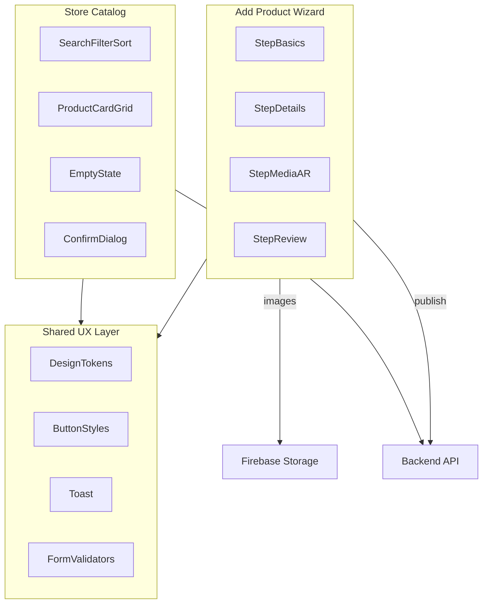

# Seller Dashboard: Add Product & Catalog UX Improvement Plan

## What you have implemented correctly

Your seller portal already has a solid foundation. These are genuine strengths — build on them rather than replacing them.

### End-to-end product lifecycle works
The create → upload → optional 3D → list → edit → delete pipeline is complete and wired to the backend:

- Create: [`SellerAddProduct.tsx`](frontend/web/src/components/SellerAddProduct.tsx) → `POST /products/store/:storeId`
- Images: Firebase Storage upload → `PUT /products/:productId`
- 3D: optional `POST /model-generation/:productId/generate`
- Catalog: [`SellerProducts.tsx`](frontend/web/src/components/SellerProducts.tsx) → `GET /products/store/:storeId`
- Edit: [`SellerEditProduct.tsx`](frontend/web/src/components/SellerEditProduct.tsx)

### Strong AR/3D UX (differentiator)
The add/edit flows handle something most seller dashboards do not:
- Live banner preview from the first uploaded image
- Click-to-select image for 3D generation
- Clear loading steps (`Saving product…` → `Generating 3D model…`)
- AR badges on catalog cards when `modelURL` exists

```168:173:frontend/web/src/components/SellerAddProduct.tsx
  const stepLabel =
    loadingStep === 'saving'
      ? 'Saving product…'
      : loadingStep === 'generating'
        ? 'Generating 3D model…'
        : 'Publish Product';
```

### Good catalog empty and error states
[`SellerProducts.tsx`](frontend/web/src/components/SellerProducts.tsx) handles three states well: loading spinner, actionable empty state with CTA, and error state with message. This is better than many early dashboards that show a blank page.

### Resilient store resolution
Both add and catalog pages fall back to `GET /stores/me` when `session.storeId` is missing — a practical fix for registration race conditions.

### Registration is your UX gold standard
[`SellerRegister.tsx`](frontend/web/src/components/SellerRegister.tsx) already demonstrates the patterns you should reuse for Add Product:
- Multi-step wizard with progress
- Per-field validation with inline errors
- Step gating (`validateStep1` before advancing)
- Structured API errors via `toUserFacingApiError()`

The add-product form currently only uses HTML5 `required` and a single top-level error banner — a clear gap compared to registration.

### Visual identity is cohesive
Warm orange brand (`#FF8A3D`), Fredoka headings, card-based layout, and `AppShell` sidebar give the portal a consistent “seller workspace” feel.

---

## What you have missed (important for UX polish)

### 1. Catalog does not scale — no search, filter, or sort
[`SellerProducts.tsx`](frontend/web/src/components/SellerProducts.tsx) renders all products in a grid with no toolbar. Once a seller has 10+ items, finding and managing products becomes painful.

**Missing:** search by name, filter by category, sort by price/date, product count summary.

### 2. Add Product is one long page — cognitive overload
All sections (Basics, Dimensions, Media/AR) are on a single scroll. For furniture listings with images and optional 3D, a wizard reduces abandonment and mirrors your best existing pattern (registration).

**Target flow (4 steps):**


| Step | Fields | Validation |
|------|--------|------------|
| 1 — Basics | Name, description, category, price | Required fields, price > 0, min description length |
| 2 — Details | Dimensions, materials, style tags | Optional; numeric checks on dimensions |
| 3 — Media & AR | Image upload, 3D toggle, image picker | At least 1 image recommended; required if 3D checked |
| 4 — Review | Read-only summary + live preview | Confirm before publish |

Reuse registration patterns: step indicator, Back/Next buttons, per-field errors, disabled Next until step valid.

### 3. Styling bugs on the catalog page
[`SellerProducts.tsx`](frontend/web/src/components/SellerProducts.tsx) uses `btn-primary` and `mt-4`, but [`SellerProducts.css`](frontend/web/src/components/SellerProducts.css) does not define them. Primary buttons on the catalog page may appear unstyled depending on load order.

Also, CSS variables like `--accent-primary`, `--color-0`, `--color-5` are used in add/edit CSS but not defined in [`index.css`](frontend/web/src/index.css) — they silently fall back to hardcoded defaults, causing subtle inconsistency across pages.

### 4. Native `alert()` / `confirm()` break the polished UI
Delete confirmation and missing-ID errors use browser dialogs in [`SellerProducts.tsx`](frontend/web/src/components/SellerProducts.tsx). These feel jarring compared to the rest of the portal.

**Replace with:** a reusable `ConfirmDialog` modal component (title, message, destructive confirm, cancel).

### 5. Weak validation and error feedback on add product
Current validation is minimal:
- HTML5 `required` only
- One global `.form-error` banner
- Generic error strings (edit page uses `toUserFacingApiError()` — add page does not)

**Missing:**
- Inline field errors (e.g. “Price must be greater than 0”)
- Image constraints (file type, max size, max count)
- Success toast after publish (currently silent redirect to catalog)
- Partial-failure clarity when product saves but images fail (orphan product risk is acknowledged in code comments)

### 6. No live “customer preview” before publish
The banner preview updates with the product name, but sellers cannot see how the listing will look in the catalog card or mobile product page (colors, materials chips, dimensions formatting). A review step with a mini product-card preview would reduce “publish and hope” anxiety.

### 7. Catalog cards lack useful seller metadata
Cards show category, price, truncated description, dimensions, and AR badge — but not:
- Stock level (field exists in `Product` interface but is never displayed)
- Image count / missing image warning
- 3D generation status (pending vs ready)
- Last updated date

For UX-polish scope, show at least **image status** and **AR status** badges — no need to add stock editing yet.

### 8. Inconsistent feedback patterns across pages
| Pattern | Registration | Add Product | Catalog | Edit Product |
|---------|-------------|-------------|---------|--------------|
| Field-level errors | Yes | No | N/A | Partial |
| Structured API errors | Yes | No | Generic | Yes |
| Loading UX | Button spinner | Step spinner | Page spinner | Page + save spinner |
| Success feedback | Success screen | Silent redirect | N/A | “Saved” button state |

Align add product and catalog with the registration/edit patterns.

---

## Recommended implementation (UX polish, phased)

### Phase 1 — Quick fixes (1–2 days)

**Fix catalog styling**
- Add `.btn-primary`, `.btn-sm` variants (or extract shared styles) to [`SellerProducts.css`](frontend/web/src/components/SellerProducts.css) or a new shared [`frontend/web/src/styles/shared.css`](frontend/web/src/styles/shared.css)
- Define missing CSS tokens in [`index.css`](frontend/web/src/index.css): `--accent-primary`, `--color-0` through `--color-6`, `--text-secondary`, `--btn-text`

**Replace native dialogs**
- Create [`ConfirmDialog.tsx`](frontend/web/src/components/ConfirmDialog.tsx) — used for delete on catalog
- Optional: `Toast.tsx` for success/error messages after publish/delete

**Improve catalog toolbar**
- Add to [`SellerProducts.tsx`](frontend/web/src/components/SellerProducts.tsx):
  - Search input (client-side filter on `name`, `description`, `materials`)
  - Category `<select>` filter (reuse `CATEGORIES` constant — extract to [`frontend/web/src/constants/categories.ts`](frontend/web/src/constants/categories.ts))
  - Sort dropdown: Price low→high, Price high→low, Name A→Z, Newest first (if API returns `createdAt`; otherwise Name/Price only)
  - Header: “{n} products” count + “Add New Product” CTA

**Catalog card polish**
- Show badges: `No image`, `AR Ready`, `{n} photos`
- Disable delete button + show spinner during delete (optimistic UI optional)

### Phase 2 — Multi-step Add Product wizard (2–3 days)

Refactor [`SellerAddProduct.tsx`](frontend/web/src/components/SellerAddProduct.tsx) into a wizard, mirroring [`SellerRegister.tsx`](frontend/web/src/components/SellerRegister.tsx):

```
frontend/web/src/components/add-product/
  AddProductWizard.tsx       # step state, navigation, submit orchestration
  StepBasics.tsx
  StepDetails.tsx
  StepMedia.tsx
  StepReview.tsx
  StepIndicator.tsx          # reuse/adapt from SellerRegister CSS
  useAddProductForm.ts       # form state + per-step validators
```

**Key behaviors:**
- `validateStep(n)` before advancing; show inline errors under fields
- Persist form state in component state (optional: `sessionStorage` draft so refresh doesn’t lose work)
- Step 3 keeps existing image preview + 3D selector UX (already good — move, don’t rewrite)
- Step 4 shows summary card matching catalog card layout + “Edit” links back to each step
- On publish: keep existing 3-step API pipeline; show progress overlay with the same `loadingStep` labels
- On success: toast “Product published” then navigate to `/products`
- On partial 3D failure: toast warning (not error banner on a page user is leaving)

**Validation rules to add:**
- Name: 3–100 chars
- Description: min 20 chars (furniture needs context for buyers)
- Price: required, > 0, reasonable max
- Images: max 8 files, max 5MB each, JPG/PNG only
- Dimensions: if any filled, all three should be filled (optional soft warning)

### Phase 3 — Shared design system light (1–2 days)

Extract duplicated styles from [`SellerAddProduct.css`](frontend/web/src/components/SellerAddProduct.css), [`SellerEditProduct.css`](frontend/web/src/components/SellerEditProduct.css), [`SellerRegister.css`](frontend/web/src/components/SellerRegister.css) into:

```
frontend/web/src/styles/
  tokens.css      # all CSS variables
  buttons.css     # .btn-primary, .btn-secondary, .btn-danger, .btn-sm
  forms.css       # .form-group, .form-error, .form-row
  feedback.css    # .spinner, .loading-state, .empty-state
```

Import from [`main.tsx`](frontend/web/src/main.tsx) once. Reduces drift and fixes the catalog button issue permanently.

**Optional small shared components:**
- `FormField` — label + input + inline error
- `EmptyState` — icon + title + description + CTA (used by catalog today)
- `LoadingState` — spinner + message

### Phase 4 — Edit page alignment (1 day, optional but recommended)

Apply the same validation helpers and `toUserFacingApiError()` to add product. Consider a “Save as draft” vs “Publish” split only if you add a `status` field later — **out of scope for UX-only polish**, but the wizard’s Review step achieves similar confidence without backend changes.

For edit: add the same `ConfirmDialog` for destructive actions and match the catalog card preview in a sidebar on wide screens.

---

## Architecture after changes



---

## What to intentionally defer (out of UX-polish scope)

These are real gaps but require backend/product decisions — do not block the wizard work:

- Stock/inventory management (`stock` in DTO unused)
- Product variants and color pickers (mobile app supports colors; seller UI does not)
- Dynamic categories from [`category.controller.ts`](backend/src/modules/category/category.controller.ts) (currently hardcoded `CATEGORIES` array)
- Draft/publish workflow
- Bulk delete / bulk edit
- Pagination (only needed at 50+ products; client-side filter is enough initially)

---

## Success criteria

After Phase 1–2, a seller should be able to:
1. Add a product in 4 guided steps with clear validation before each advance
2. See a review summary that matches the catalog card before publishing
3. Search and filter their catalog without scrolling through everything
4. Delete a product via an in-app confirmation modal (no browser `confirm()`)
5. See consistently styled buttons and form errors across all seller pages

---

## Files to touch (primary)

| File | Change |
|------|--------|
| [`SellerAddProduct.tsx`](frontend/web/src/components/SellerAddProduct.tsx) | Refactor to wizard shell or replace with `AddProductWizard.tsx` |
| [`SellerProducts.tsx`](frontend/web/src/components/SellerProducts.tsx) | Toolbar, filters, ConfirmDialog, card badges |
| [`SellerProducts.css`](frontend/web/src/components/SellerProducts.css) | Toolbar layout, fix missing button styles |
| [`index.css`](frontend/web/src/index.css) | Complete design tokens |
| New: `styles/shared.css`, `components/ConfirmDialog.tsx`, `components/add-product/*` | Shared UX layer + wizard steps |
| [`SellerRegister.tsx`](frontend/web/src/components/SellerRegister.tsx) | Reference only — copy step indicator + validation patterns |

No backend changes required for this UX-polish scope.
